# 🛒 Go gRPC GraphQL Microservices on AWS EKS

### End-to-end DevSecOps: Terraform · Jenkins · SonarQube · OWASP · Trivy · ECR · EKS · Argo CD · Secrets Manager · Prometheus · Grafana


A **microservices e-commerce platform** written in **Go** (three gRPC services plus a GraphQL gateway) with a **React** storefront, delivered to **Amazon EKS** through a **DevSecOps pipeline** and **GitOps**:

- **Infrastructure as Code:** Terraform builds everything (remote state with locking, `dev` and `prod` environments).
- **Security gates that actually block:** SonarQube quality gate, OWASP Dependency-Check, Trivy filesystem scan, and a **Trivy image gate** that stops fixable CRITICAL CVEs *before* the push.
- **GitOps:** Jenkins never touches the cluster. It pushes an immutable image and commits the new tag; **Argo CD** deploys it.
- **Locked-down cluster:** **private-only EKS API**, reached through an **SSM bastion** (no SSH anywhere), KMS-encrypted secrets, IMDSv2 hop limit 1, Pod Identity.
- **Secrets done right:** DB passwords are generated by Terraform **straight into AWS Secrets Manager** (never in git, state or logs) and synced by **External Secrets Operator**.
- **Observability:** Prometheus and Grafana.

> 📚 **Docs:** [Full process document](docs/PROCESS.md) · [Step-by-step recreation guide](docs/RECREATE-GUIDE.md) · [Interview Q&A](docs/INTERVIEW-QUESTIONS.md)

---

## 📸 Screenshots

| Storefront – home | Cart |
|---|---|
| 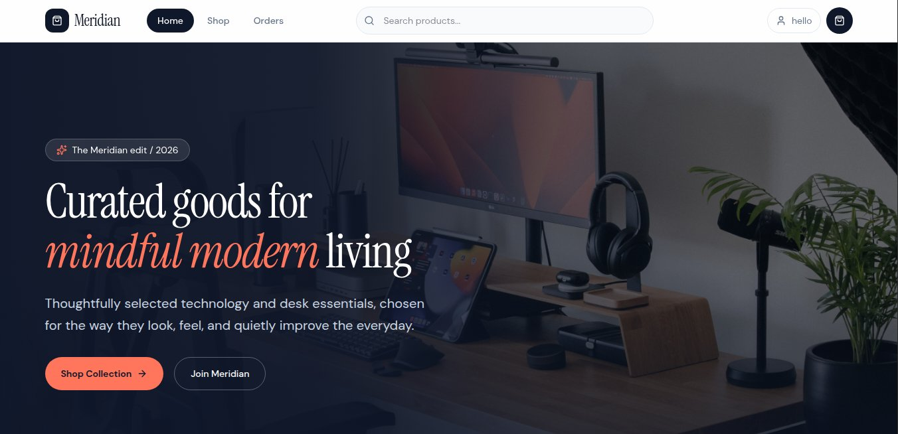 | 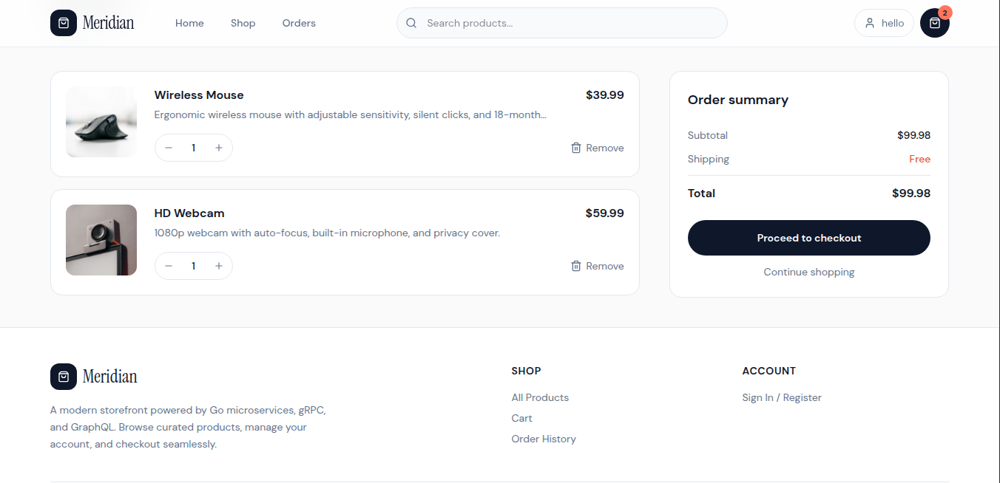 |

| Order history (order → account + catalog over gRPC) | Account |
|---|---|
| 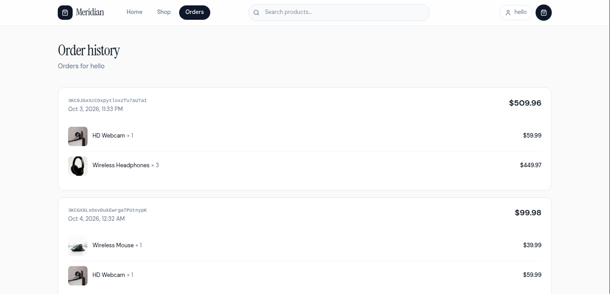 | 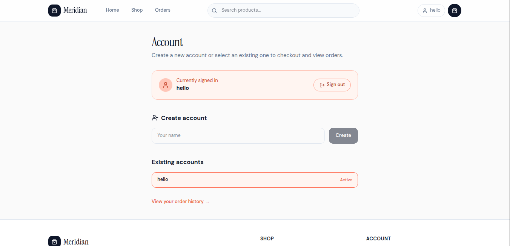 |

| SonarQube – backend (Go services) | SonarQube – frontend (React) |
|---|---|
| 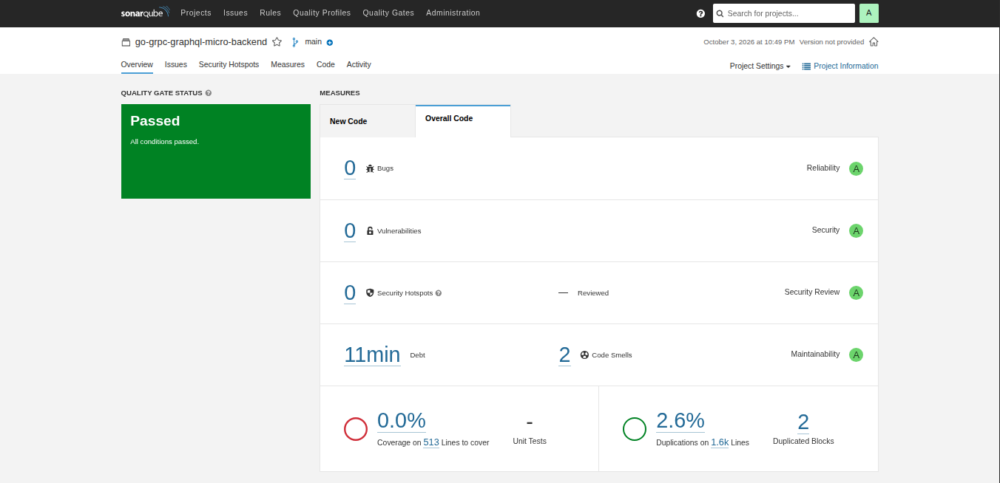 | 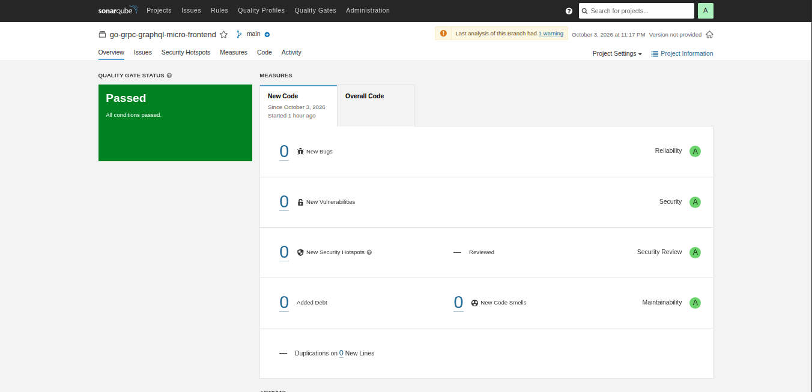 |

| Jenkins – backend pipeline (4 Go images) | Jenkins – frontend: build #2 **blocked by the Trivy gate**, #3 green after the fix |
|---|---|
| 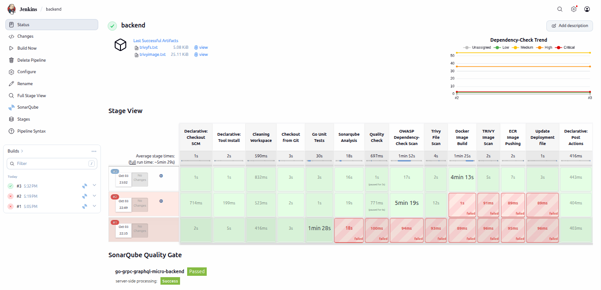 | 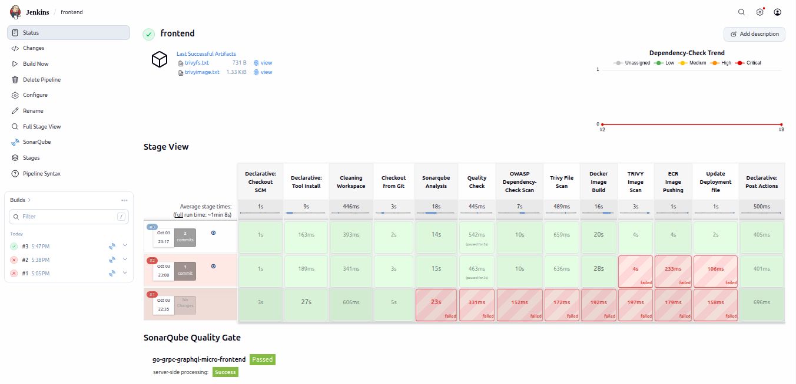 |

| Grafana – node CPU/memory, pods running | Grafana – memory per container |
|---|---|
| 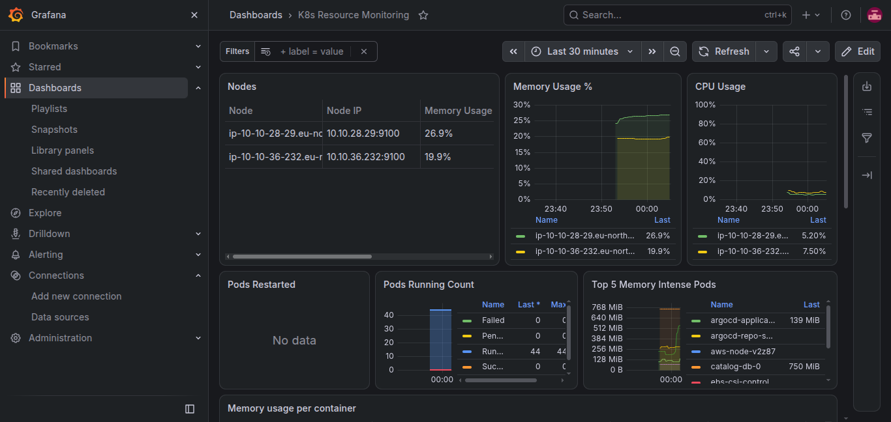 | 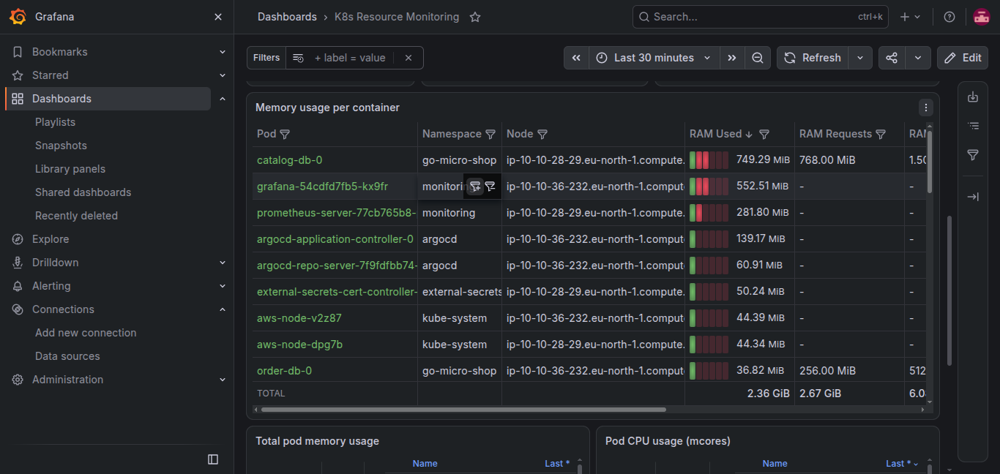 |

| Argo CD – Synced/Healthy; last sync is the pipeline's `chore(deploy)` tag bump; "5 parameter overrides" = ECR registry injected at deploy time | Amazon ECR (immutable tags, scan on push) |
|---|---|
| 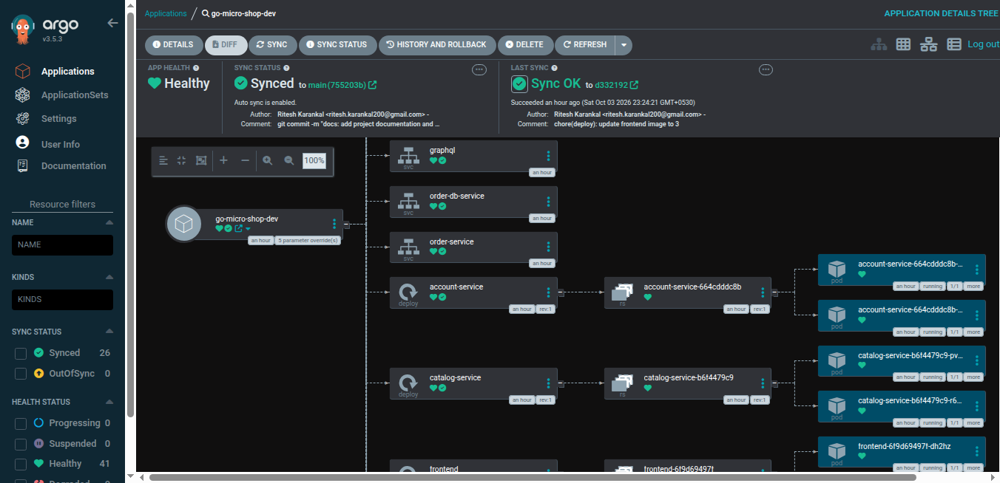 | 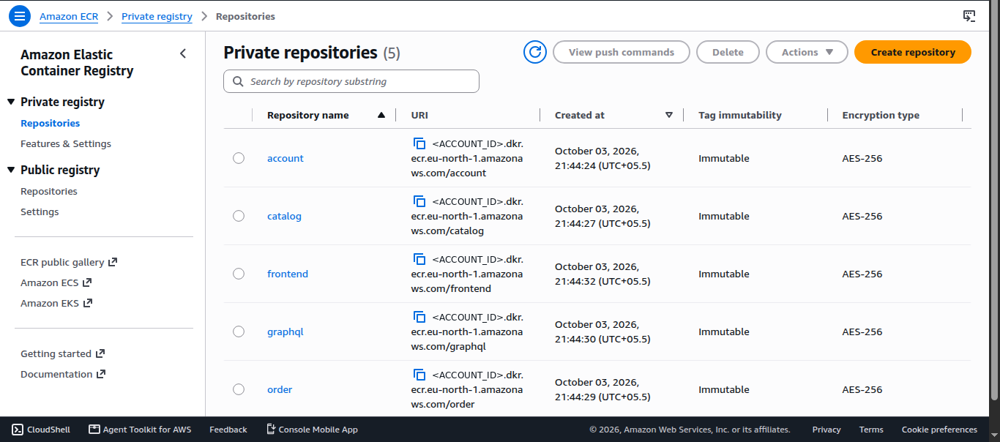 |

| Jenkins – EKS Terraform pipeline (plan → approve → apply) | GraphQL Playground – one query served by catalog, account and order services |
|---|---|
| 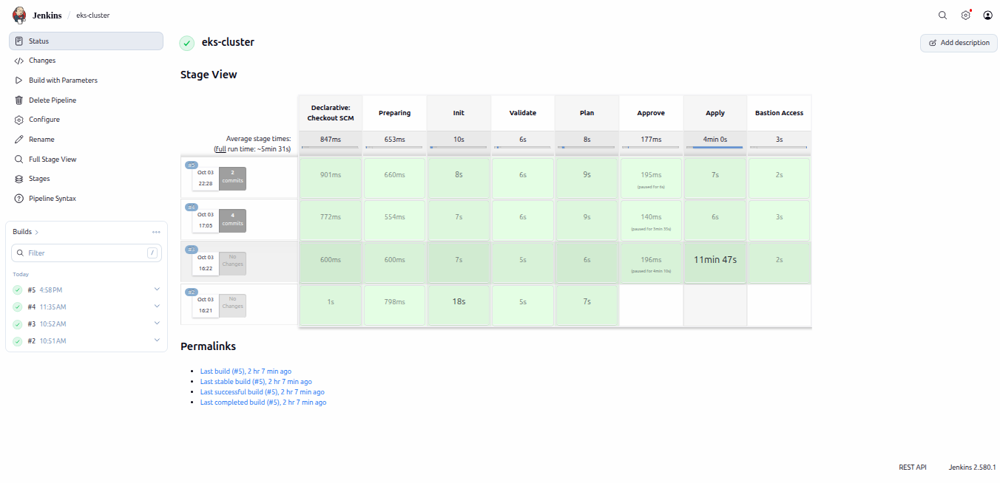 | 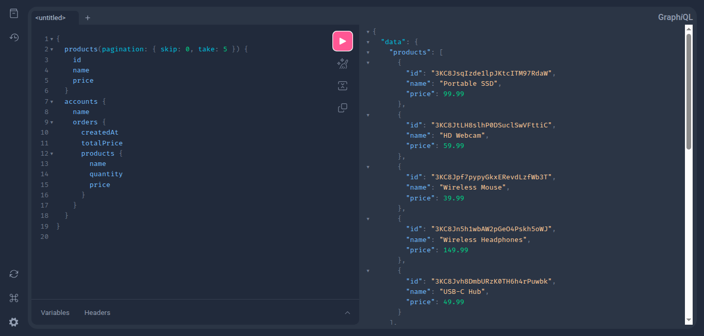 |

---

## 🏗️ Architecture

### Platform

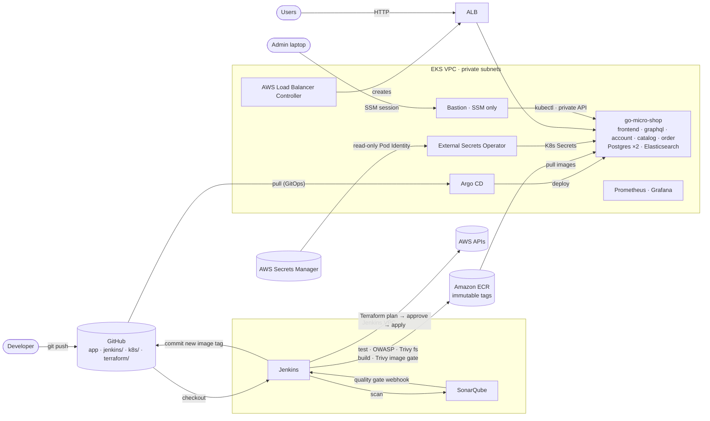

### Application

```text
                         ┌─────────────────────┐
                         │      Browser        │
                         │  React storefront   │
                         └──────────┬──────────┘
                                    │ HTTP (ALB: / → frontend, /graphql & /playground → gateway)
                                    ▼
                         ┌─────────────────────┐
                         │   GraphQL Gateway   │
                         │   (gqlgen) :8080    │
                         └──────────┬──────────┘
                         ┌──────────┼──────────┐
                       gRPC       gRPC       gRPC
                         ▼          ▼          ▼
                  ┌──────────┐ ┌──────────┐ ┌──────────┐
                  │ Account  │ │ Catalog  │ │  Order   │──gRPC──▶ Account, Catalog
                  │ Service  │ │ Service  │ │ Service  │
                  └────┬─────┘ └────┬─────┘ └────┬─────┘
                       ▼             ▼             ▼
                  PostgreSQL    Elasticsearch   PostgreSQL
```

### Delivery flow

```text
git push ─▶ Jenkins: go test → SonarQube → Quality Gate ✋ → OWASP → Trivy fs → docker build
         → Trivy image gate ✋ (fixable CRITICAL) → push <svc>:<build> to ECR (immutable)
         → bump tag in k8s/base/kustomization.yaml → git push
         ─▶ Argo CD detects the commit → kustomize build + registry override → rolling update on EKS
Rollback = git revert of the tag commit.
```

---

## ✨ Highlights

| Area | What's implemented |
|---|---|
| **IaC** | Terraform for the Jenkins server and EKS; S3 remote state with native locking; partial backend config so the account ID never enters git; `dev` (2 AZ, 1 NAT) and `prod` (3 AZ, NAT per AZ) via tfvars and state keys |
| **CI/CD** | Jenkins pipelines for backend (4 images) and frontend; Terraform pipeline with **plan → manual approval → apply of the saved plan** |
| **DevSecOps** | SonarQube (blocking gate), OWASP Dependency-Check, Trivy fs, **Trivy image gate before push**, ECR scan-on-push, **immutable tags** |
| **Kubernetes** | EKS 1.36, AL2023 nodes in private subnets, EBS CSI with an encrypted gp3 default StorageClass, ALB via AWS Load Balancer Controller (`target-type: ip`) |
| **GitOps** | Argo CD with auto-sync, prune and self-heal; Kustomize base + per-env overlays; ECR registry injected by Argo CD so no account ID is in git |
| **Security** | Private API endpoint, SSM-only bastion, EKS access entries, KMS envelope encryption, control-plane audit logs, IMDSv2 hop limit 1, Pod Identity per controller, no AWS keys in CI, IP-restricted admin UIs |
| **Secrets** | Terraform `ephemeral` passwords + **write-only** Secrets Manager values → External Secrets Operator → Kubernetes Secrets |
| **Observability** | Prometheus (node-exporter, kube-state-metrics, Alertmanager) + Grafana dashboards |

> A real example of the gate working (see the frontend pipeline screenshot above): the frontend image (`nginx:1.27-alpine`, OpenSSL 3.3.3) was **blocked by Trivy** for a critical CVE. The fix was moving to the supported `nginx:1.30-alpine` branch plus `apk upgrade`. See [problems and fixes](docs/PROCESS.md#21-problems-encountered-and-fixes).

---

## 🧰 Tech Stack

| Layer | Technology |
|---|---|
| Services | Go 1.26, gRPC, Protocol Buffers, gRPC reflection |
| API gateway | GraphQL (gqlgen) |
| Frontend | React 19, TypeScript, Vite, Tailwind CSS, nginx |
| Data | PostgreSQL 16 (accounts, orders), Elasticsearch (catalog and search) |
| Containers | Docker (multi-stage, Alpine), Docker Compose (local), Amazon ECR |
| Infrastructure | Terraform, AWS VPC, EC2, EKS, IAM, KMS, S3, CloudWatch, Systems Manager |
| CI | Jenkins, SonarQube, OWASP Dependency-Check, Trivy |
| CD | Argo CD, Kustomize |
| Kubernetes add-ons | AWS Load Balancer Controller, EBS CSI driver, EKS Pod Identity, External Secrets Operator |
| Secrets | AWS Secrets Manager |
| Monitoring | Prometheus, Grafana |

---

## ✨ Application Features

### 👤 Account Management
- Create accounts, retrieve by ID or as a list, pagination

### 📦 Product Catalog
- Create and retrieve products, **full-text search** with Elasticsearch, filter by IDs, pagination
- Sample products are seeded on startup

### 🛍️ Order Processing
- Create orders for accounts; the account is validated through the Account Service
- Products are validated and priced through the Catalog Service; totals calculated
- Retrieve an account's orders with product details

### 🛒 Storefront ("Meridian")
- Home, shop, product detail, cart, checkout, orders and account pages backed by the GraphQL API

### 🔌 Communication
- gRPC between services, GraphQL for clients, protobuf contracts, gRPC reflection for debugging

---

## 📁 Project Structure

```text
go-grpc-graphql-micro/
├── account/  catalog/  order/      # gRPC services: proto, pb, repository, service, server, client, cmd, app.dockerfile
├── graphql/                        # GraphQL gateway (gqlgen): schema, resolvers, app.dockerfile
├── frontend/                       # React + Vite + TS storefront, nginx.conf, Dockerfile
├── docker-compose.yaml             # local stack
├── jenkins/
│   ├── Jenkinsfile-Backend         # account · catalog · order · graphql
│   └── Jenkinsfile-Frontend        # frontend
├── k8s/
│   ├── base/                       # namespace, SecretStore, databases, services, gateway, ALB ingress, image tags
│   ├── overlays/{dev,prod}/        # env-specific ExternalSecrets
│   └── scripts/create-argocd-app.sh
├── terraform/
│   ├── jenkins-server/             # Jenkins + SonarQube EC2 (VPC, SG, IAM, EIP, setup.sh)
│   └── eks-cluster/                # VPC, EKS, nodes, add-ons, bastion, Secrets Manager, Jenkinsfile, envs/
└── docs/                           # process doc, recreation guide, interview Q&A, screenshots
```

---

## 🚀 Quick Start (local, Docker Compose)

**Prerequisites:** Go, Docker, Docker Compose, Git.

```bash
git clone https://github.com/ritesh-karankal/go-grpc-graphql-micro.git
cd go-grpc-graphql-micro

cat > .env <<'EOF'
POSTGRES_USER=postgres
POSTGRES_PASSWORD=<choose-a-password>
POSTGRES_DB=app
EOF

docker compose up -d --build
docker compose ps
```

| URL | What |
|---|---|
| http://localhost:3000 | Storefront |
| http://localhost:8000/playground | GraphQL Playground |
| http://localhost:8000/graphql | GraphQL endpoint |

Useful commands:
```bash
docker compose logs -f                 # all logs
docker compose logs -f order           # one service
docker compose build --no-cache account
docker compose restart account
docker compose down                    # stop
docker compose down -v                 # stop and delete data
```

## ☁️ Deploy to AWS

The complete, beginner-friendly walkthrough with every command is in **[docs/RECREATE-GUIDE.md](docs/RECREATE-GUIDE.md)**. In short:

```bash
# 1. State bucket (once)
aws s3api create-bucket --bucket go-grpc-micro-tfstate-<ACCOUNT_ID> --region eu-north-1 \
  --create-bucket-configuration LocationConstraint=eu-north-1

# 2. Jenkins + SonarQube server
cd terraform/jenkins-server && terraform init -backend-config=backend.hcl && terraform apply

# 3. EKS cluster: Jenkins job "eks-cluster" → Environment=dev, Terraform_Action=apply → Approve

# 4. From the bastion: AWS Load Balancer Controller, Argo CD, External Secrets Operator (Helm)

# 5. ECR repos (immutable, scan on push), then run Jenkins jobs "backend" and "frontend"

# 6. From the bastion: deploy with Argo CD
./k8s/scripts/create-argocd-app.sh dev
kubectl -n go-micro-shop get ingress go-micro-shop     # → app URL
```

---

## 🔐 Security Design

| Threat | Control |
|---|---|
| Leaked credentials in git | Secrets Manager + ESO; write-only Terraform; `backend.hcl` and tfvars git-ignored; history scanned with gitleaks |
| Vulnerable dependencies or images | OWASP, Trivy fs, **Trivy image gate before push**, ECR scan-on-push |
| Image tampering / "what's running?" | Immutable ECR tags = Jenkins build number; every deploy is a git commit |
| Exposed control plane | **Private-only EKS API**; admin access only via the SSM bastion; explicit access entries |
| Pod stealing node credentials | IMDSv2 with hop limit 1; per-controller Pod Identity roles |
| Data at rest | KMS envelope encryption for Secrets; encrypted EBS and S3 |
| CI holding cluster keys | Pull-based GitOps: Jenkins has no cluster access |
| Unauthenticated dashboards | Argo CD / Prometheus / Grafana load balancers restricted to an allowlisted IP |

Accepted lab trade-offs (documented): the Jenkins IAM role is broad and Jenkins is served over HTTP, there's no TLS without a domain, and the Load Balancer Controller IAM was created manually.

---

## 🔍 GraphQL API

### Accounts
```graphql
query { accounts { id name } }

query { accounts(id: "account_id") { id name } }

mutation { createAccount(account: { name: "New Account" }) { id name } }
```

### Products
```graphql
query { products { id name description price } }

query { products(pagination: { skip: 0, take: 10 }) { id name price } }

# Full-text search (Elasticsearch)
query { products(pagination: { skip: 0, take: 5 }, query: "laptop") { id name description price } }

mutation {
  createProduct(product: { name: "New Product", description: "A new product", price: 19.99 }) {
    id name description price
  }
}
```

### Orders
```graphql
mutation {
  createOrder(order: { accountId: "account_id", products: [{ id: "product_id", quantity: 2 }] }) {
    id totalPrice products { name quantity price }
  }
}

query {
  accounts(id: "account_id") {
    name
    orders { id createdAt totalPrice products { name quantity price } }
  }
}
```

When an order is created, the Order Service validates the account (Account Service), retrieves the products (Catalog Service), calculates the total, stores the order in PostgreSQL and returns it.

---

## 🔌 gRPC Services

| Service | Operations |
|---|---|
| `pb.AccountService` | `PostAccount`, `GetAccount`, `GetAccounts` |
| `pb.CatalogService` | create, get, list and search products |
| `pb.OrderService` | `PostOrder`, `GetOrdersForAccount` |

```protobuf
service AccountService {
    rpc PostAccount (PostAccountRequest) returns (PostAccountResponse);
    rpc GetAccount  (GetAccountRequest)  returns (GetAccountResponse);
    rpc GetAccounts (GetAccountsRequest) returns (GetAccountsResponse);
}
```

<details>
<summary><b>⚙️ Regenerating gRPC code</b></summary>

```bash
# protoc
wget https://github.com/protocolbuffers/protobuf/releases/download/v23.0/protoc-23.0-linux-x86_64.zip
unzip protoc-23.0-linux-x86_64.zip -d protoc && sudo mv protoc/bin/protoc /usr/local/bin/

# Go plugins
go install google.golang.org/protobuf/cmd/protoc-gen-go@latest
go install google.golang.org/grpc/cmd/protoc-gen-go-grpc@latest
export PATH="$PATH:$(go env GOPATH)/bin"

# generate (repeat for catalog and order)
protoc --go_out=./account/pb --go-grpc_out=./account/pb account/account.proto
```

Keep `option go_package` aligned with the module path, e.g. `github.com/ritesh-karankal/go-grpc-graphql-micro/account/pb`.
</details>

---

## 🧠 Architecture Decisions

| Decision | Why |
|---|---|
| **gRPC** internally | Typed contracts, generated clients, efficient binary transport |
| **GraphQL** gateway | One endpoint; clients request exactly the fields they need; aggregates three services |
| **PostgreSQL** for accounts and orders | Transactional integrity |
| **Elasticsearch** for the catalog | Full-text search across name and description |
| **Database per service** | Independent schemas and scaling, clear ownership |
| **Private EKS + bastion** | No internet-reachable control plane |
| **GitOps (pull) over CI push** | CI never needs cluster credentials; audit trail; one-commit rollback |
| **Immutable tags** | Traceability and rollback; makes GitOps changes visible |
| **Kustomize layering** | Tags in git, registry (account ID) injected at deploy time |
| **Secrets Manager + ESO** | Secrets never in git or state; IAM-audited; rotatable centrally |
| **Pod Identity over IRSA** | No OIDC provider; simpler trust policy |
| **ALB controller over ingress-nginx** | Native AWS LB; ingress-nginx was retired in March 2026 |

More detail on every decision and trade-off is in [docs/PROCESS.md](docs/PROCESS.md).

---

## 🐞 Debugging

```bash
# Local (Compose)
docker compose exec graphql getent hosts account
docker compose exec catalog wget -qO- http://catalog_db:9200/_cat/indices?v

# EKS (from the bastion)
kubectl -n go-micro-shop get pods
kubectl -n go-micro-shop describe pod <pod>
kubectl -n go-micro-shop logs <pod> --previous
kubectl -n go-micro-shop get externalsecret
kubectl -n argocd get application go-micro-shop-dev
kubectl -n kube-system logs deploy/aws-load-balancer-controller --tail=50
```

---

## 📈 Roadmap

- [ ] HTTPS with ACM certificates on the ALB
- [ ] Argo CD sync waves and app-of-apps for platform add-ons
- [ ] Autoscaling and resilience: HPA, PodDisruptionBudgets, NetworkPolicies
- [ ] Centralized logging (Loki) and distributed tracing (OpenTelemetry)
- [ ] Unit and integration tests with coverage reported to SonarQube
- [ ] Managed data stores for production (RDS, OpenSearch)

---

## 🎯 What This Project Demonstrates

**Backend:** service decomposition, the API-gateway pattern, database-per-service, synchronous gRPC communication, typed APIs, search-oriented storage.

**DevOps / Cloud:** Infrastructure as Code with environment separation, CI with security gates, GitOps continuous delivery, private Kubernetes on AWS, workload identity, cloud-native secrets management, monitoring, cost-aware design, and systematic troubleshooting (twenty-plus real issues found and fixed, [documented here](docs/PROCESS.md#21-problems-encountered-and-fixes)).

---

⭐ If this project helped you understand Go microservices or DevSecOps on Kubernetes, consider giving it a star.
