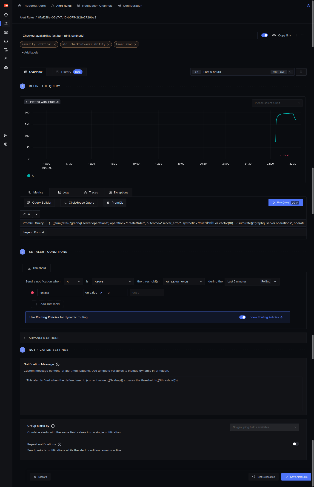
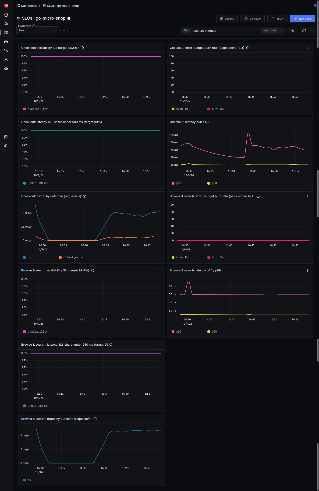
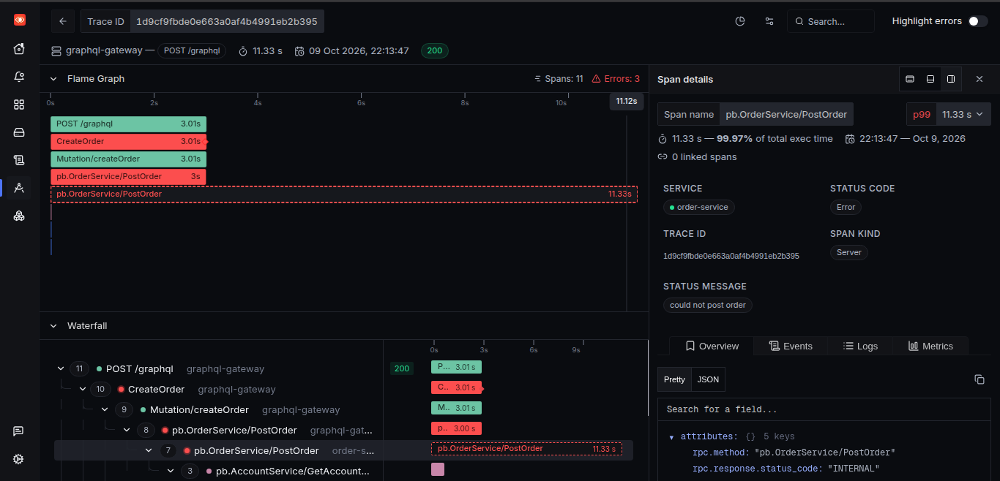
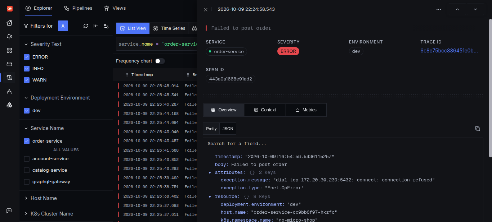
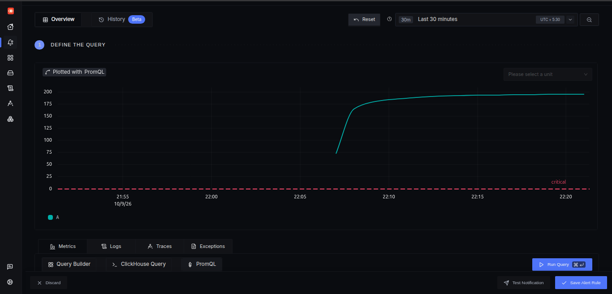
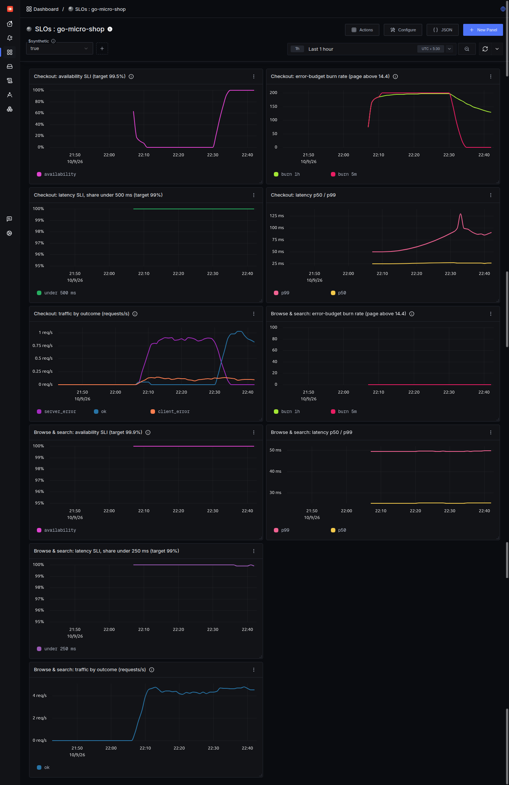

# Service Level Objectives: go-micro-shop

| | |
|---|---|
| **Service** | go-micro-shop: GraphQL gateway + account, catalog and order gRPC services on EKS |
| **Owner** | Ritesh Karankal |
| **Telemetry** | OpenTelemetry (Go SDK) → SigNoz (OTLP); same metrics also scraped by Prometheus |
| **Status** | Implemented and validated with a fault drill (see [Validation](#8-validation-fault-drill)) |
| **Last reviewed** | 2026-10-09 (fault drill) |

## TL;DR

| User journey | SLI | SLO (28 days) | Error budget |
|---|---|---|---|
| **Checkout** (`createOrder`) | Availability: orders not failed by the system | **99.5%** | 0.5% (≈ 1 in 200 orders) |
| **Checkout** (`createOrder`) | Latency: orders handled in < 500 ms | **99%** | 1% |
| **Browse & search** (`products`) | Availability: queries not failed by the system | **99.9%** | 0.1% |
| **Browse & search** (`products`) | Latency: queries handled in < 250 ms | **99%** | 1% |

Measured at the GraphQL gateway, per operation, real-user traffic only. Alerts use multi-window burn rates (page at 14.4× / 6×, ticket at 1×). A drill that took the orders database down fired the checkout burn-rate alert, led from the alert to the failing span (`order-service` → `INTERNAL: could not post order`), and recovered within ~10 s of the database coming back; the ~23-minute outage used ≈ 11% of the 28-day checkout error budget.

---

## 1. Service and user journeys

```
Browser ──HTTP──▶ ALB ──▶ GraphQL gateway ──gRPC──▶ account-service ──▶ Postgres
                              │            ──gRPC──▶ catalog-service ──▶ Elasticsearch
                              │            ──gRPC──▶ order-service   ──▶ Postgres
                              │                        └──gRPC──▶ account, catalog
                              └─ OTLP (traces, metrics, logs) ──▶ SigNoz
```

The SLOs cover the two journeys that matter most to a shop:

| Journey | GraphQL operation | Why it matters |
|---|---|---|
| **Checkout** | `createOrder` (mutation) | Revenue. Touches every service (gateway → order → account + catalog → Postgres). Failure is costly and visible. |
| **Browse & search** | `products` (query) | Highest traffic, first thing users see. Slowness here drives users away. |

Other operations (`accounts` for order history, `createAccount`) are instrumented identically and can get SLOs the same way.

## 2. Where and how it is measured

### Measured at the gateway, per GraphQL operation
The gateway is the first service a request reaches and the closest point to the user that we control. Measuring there includes every downstream service, database and network hop *inside* the cluster.

HTTP status codes **can't** be used: GraphQL returns **HTTP 200 even when a resolver fails** (the error is in the response body). A gqlgen extension in the gateway ([`graphql/operation_metrics.go`](../graphql/operation_metrics.go)) therefore records two OpenTelemetry metrics per operation:

| Metric | Type | Attributes |
|---|---|---|
| `graphql.server.operations` | counter | `operation`, `operation_type`, `outcome`, `synthetic` |
| `graphql.server.operation.duration` | histogram (s), buckets 0.05 / 0.1 / **0.25** / **0.5** / 0.8 / 1 / 2.5 / 5 / 10 | same |

The SLO thresholds (0.25 s, 0.5 s) are bucket boundaries, so "share of requests faster than X" is read exactly from the histogram, not estimated.

The same attributes are set on the GraphQL operation's **trace span**, so a burning SLO leads directly to the traces behind it with the same filter (`operation`, `outcome`).

### Good, bad and excluded events

| `outcome` | Meaning | Counts as |
|---|---|---|
| `ok` | no errors | **good** |
| `client_error` | only the caller's mistakes: gRPC `NotFound`, `InvalidArgument`, …, or an invalid GraphQL query | **excluded**: not our failure |
| `server_error` | any error caused by us: gRPC `Internal`, `Unavailable`, `DeadlineExceeded`, unexpected errors | **bad** |

This only works because the backend services return **meaningful gRPC status codes**: an unknown account is `NotFound`, a database failure is `Internal`, an unreachable dependency is `Unavailable`. Before this work, every error was `Unknown`, and a user typing a wrong ID would have counted as an outage.

### Real users only
Load tests and probes send `X-Synthetic: true`; the gateway records them with `synthetic="true"`. SLIs use `synthetic="false"`.

> **Demo environment note:** this cluster has no real customers, so the dashboards have a `synthetic` selector, and the validation screenshots show **synthetic traffic** (a load generator that behaves like shoppers: [`scripts/loadgen.py`](../scripts/loadgen.py)). The SLO definitions themselves are for real users.

### What is *not* measured (known gaps)
- **The user's network and the ALB.** Measured at the gateway, the SLI misses failures before the request reaches it (DNS, ALB, client network). A browser-side SLI (OpenTelemetry web SDK) or ALB metrics would close this gap.
- **Frontend rendering.** Out of scope for these SLOs.

## 3. SLI and SLO specifications

All queries are PromQL as run in SigNoz (dotted OpenTelemetry names are quoted). `$window` is the measurement window.

### 3.1 Checkout availability: 99.5% over 28 days

**SLI:** the proportion of `createOrder` operations from real users that did not fail because of the system.

```promql
1 - (
  (sum(rate({"graphql.server.operations", operation="createOrder", outcome="server_error", synthetic="false"}[$window])) or vector(0))
  /
  sum(rate({"graphql.server.operations", operation="createOrder", outcome=~"ok|server_error", synthetic="false"}[$window]))
)
```
Valid events = `ok + server_error` (client errors excluded from both sides). `or vector(0)` makes the error count 0 when there were no errors at all; without it the query returns nothing instead of 100%.

### 3.2 Checkout latency: 99% under 500 ms over 28 days

**SLI:** the proportion of successful `createOrder` operations from real users handled in under 500 ms.

```promql
sum(rate({"graphql.server.operation.duration.bucket", operation="createOrder", outcome="ok", synthetic="false", le="0.5"}[$window]))
/
sum(rate({"graphql.server.operation.duration.count",  operation="createOrder", outcome="ok", synthetic="false"}[$window]))
```

### 3.3 Browse & search availability: 99.9% over 28 days
Same as 3.1 with `operation="products"`.

### 3.4 Browse & search latency: 99% under 250 ms over 28 days
Same as 3.2 with `operation="products"` and `le="0.25"`.

### Why these targets
- **Baseline from load tests** (in-cluster, measured by these metrics, 10 simulated shoppers, ~1 order/s):
  - checkout (`createOrder`): **p50 ≈ 25 ms, p99 ≈ 50–90 ms**, one spike to ~130 ms; **0 server errors**;
  - browse & search (`products`): **p50 ≈ 28 ms, p99 ≈ 50 ms**, one spike to ~65 ms; **0 server errors**.

  The thresholds (500 ms checkout, 250 ms browse) sit well above the measured p99, so normal variation and short spikes don't burn budget, while a real slowdown (5–10× normal) does.
- **Checkout 99.5% < browse 99.9%:** checkout depends on four services and three datastores (two Postgres databases and Elasticsearch); browse on two services and one datastore. Promising the same availability for both would mean the checkout SLO is mostly measuring browse's dependencies' luck.
- **28-day rolling window:** long enough to smooth single incidents, short enough to react within a release cycle; aligns roughly with a month.

## 4. Error budgets

| SLO | Budget (28 days) | At ~10 orders/min | Burn rate 1 = |
|---|---|---|---|
| Checkout availability 99.5% | 0.5% of orders | ≈ 2,000 failed orders | budget exactly used up in 28 days |
| Browse availability 99.9% | 0.1% of queries | | |

**Burn rate** = observed error ratio ÷ budgeted error ratio. For checkout: `error_ratio / 0.005`. A burn rate of 14.4 sustained for 1 hour consumes 2% of the 28-day budget (14.4 × 1 h ÷ 672 h).

### Error budget policy
| Budget remaining | Action |
|---|---|
| > 50% | Normal: features ship as usual. |
| 25–50% | Releases need a passing load test + rollout test (no `server_error` during a rollout). |
| < 25% | Reliability work first: fix the top contributor (from SigNoz traces with `outcome=server_error`) before new features. |
| Exhausted | Feature freeze for the service until the SLI recovers above target over 7 days; a postmortem in [`journal.md`](../journal.md). |

## 5. Alerting: multi-window burn rates

Alerting on every error pages people for noise; alerting on the 28-day SLI fires too late. Multi-window burn-rate alerts (Google SRE Workbook, ch. 5) page only when the budget is burning fast **and** still burning now.

| Severity | Long window | Short window | Burn rate | Budget consumed when it fires | Action | Status |
|---|---|---|---|---|---|---|
| **Page** | 1 h | 5 min | > 14.4 | 2% | immediate response | **implemented** (checkout), validated by the drill |
| **Page** | 6 h | 30 min | > 6 | 5% | immediate response | planned |
| **Ticket** | 3 d | 6 h | > 1 | 10% | fix within working hours | planned |

The fast-burn tier catches outages like the drill's; the slower tiers catch smaller, steady error rates that would still exhaust the budget. Browse & search uses the same rules with `operation="products"` and `/ 0.001` (planned).

The short window makes the alert stop soon after a fix; the long window stops a short blip from paging.

**Checkout availability, fast-burn page** (SigNoz alert, PromQL, fires when the expression returns a value):

```promql
(
  ((sum(rate({"graphql.server.operations", operation="createOrder", outcome="server_error", synthetic="false"}[1h])) or vector(0))
   / sum(rate({"graphql.server.operations", operation="createOrder", outcome=~"ok|server_error", synthetic="false"}[1h]))) / 0.005 > 14.4
)
and
(
  ((sum(rate({"graphql.server.operations", operation="createOrder", outcome="server_error", synthetic="false"}[5m])) or vector(0))
   / sum(rate({"graphql.server.operations", operation="createOrder", outcome=~"ok|server_error", synthetic="false"}[5m]))) / 0.005 > 14.4
)
```
Two copies of this rule exist: one with `synthetic="false"` (real users, the one that would page) and one with `synthetic="true"` for drills.

The rule in SigNoz, with labels `severity: critical`, `slo: checkout-availability`, `team: shop`. The plotted line is the 1 h burn rate and only exists while *both* windows exceed 14.4: during the drill from ~22:07 to ~22:33 (peaking ≈ 195). The rule fires when the value is above 0 at least once in a rolling 5-minute window:



The alert's description points to a saved SigNoz trace view (`operation = createOrder`, `outcome = server_error`), so the responder starts from the failing requests, not from a graph.

Planned supporting (non-SLO) alerts: new exceptions (SigNoz Exceptions), and a burst of `ERROR` logs per service.

## 6. Dashboard

The SigNoz dashboard *SLOs : go-micro-shop* has a section per journey: availability SLI, burn rate (1 h and 5 min), latency SLI, p50/p99, and traffic by outcome, with a `synthetic` selector (real users vs. test traffic). A 28-day "error budget remaining" panel needs ≥ 28 days of metrics retention and is listed under next steps.

The dashboard is code: [`k8s/monitoring/signoz-slo-dashboard.json`](../k8s/monitoring/signoz-slo-dashboard.json) (SigNoz → Dashboards → New dashboard → Import JSON).

Baseline (10 simulated shoppers, `synthetic = true`, 30 minutes; the flat stretch around 16:33–16:43 is a pause between two load runs):

| | Checkout (`createOrder`) | Browse & search (`products`) |
|---|---|---|
| Availability SLI | 100% (target 99.5%) | 100% (target 99.9%) |
| Burn rate (1 h / 5 min) | 0 / 0 | 0 / 0 |
| Latency SLI | 100% under 500 ms (target 99%) | 100% under 250 ms (target 99%) |
| p50 / p99 | ≈ 25 ms / ≈ 50–90 ms (one spike ≈ 130 ms) | ≈ 28 ms / ≈ 50 ms (one spike ≈ 65 ms) |
| Traffic | ≈ 1 req/s ok, ≈ 0.1 req/s client errors (excluded) | ≈ 4.5 req/s ok |



## 7. From an alert to the root cause

The telemetry is connected end to end, which is what makes an SLO alert actionable:

1. **Alert:** checkout fast-burn fires → link to the saved trace view.
2. **Traces:** `operation = createOrder`, `outcome = server_error`: the failing requests.
3. **One trace:** the waterfall shows the failing span (red) and which service/database it was in.
4. **Logs:** the span's log line (same `trace_id`): `Failed to post order`, `exception.message: dial tcp <order-db>:5432: connect: connection refused`. That's the root cause in one line: order-service can't reach Postgres.


From the drill: the gateway's `CreateOrder` fails at its 3 s timeout (HTTP still 200), the account lookup succeeds, and order-service's `PostOrder` fails with `INTERNAL: could not post order`.

And the log line behind it, found by filtering Logs on `service.name = order-service` and `ERROR`; its trace ID links back to the trace above:



## 8. Validation: fault drill

**Goal:** prove the SLIs, burn-rate alerts and the path to the root cause work, by breaking the system on purpose.

**Method:**
1. Generate steady shopper traffic: `python3 scripts/loadgen.py http://<ALB> 2400 10` (10 shoppers, 40 minutes).
2. Pause Argo CD self-heal (see below), then take the orders database away:
   `kubectl -n go-micro-shop scale statefulset order-db --replicas=0`
3. Wait for the checkout fast-burn alert; follow it to the cause.
4. Restore: `kubectl -n go-micro-shop scale statefulset order-db --replicas=1`, re-enable self-heal, and watch the SLI and alert recover.

In this run the traffic started at about the same time as the outage, so the "healthy before" picture is the separate baseline in [section 6](#6-dashboard).

**Expected:** `createOrder` fails with `Internal` (order-service can't insert) → `outcome=server_error` → checkout availability drops → the burn rate exceeds 14.4 in both windows → the alert fires. Browse SLOs are unaffected (catalog doesn't use `order-db`).

**Before starting:** Argo CD runs with `selfHeal: true` and immediately put `order-db` back to 1 replica on the first attempt (GitOps working as designed). The drill procedure therefore pauses self-heal on the Application, and re-enables it afterwards:
```bash
kubectl -n argocd patch application go-micro-shop-dev --type merge \
  -p '{"spec":{"syncPolicy":{"automated":{"prune":true,"selfHeal":false}}}}'
```

**Results** (2026-10-09, times IST):

| Time | T+ | Event | Evidence |
|---|---|---|---|
| ~22:06:30 | 0 | `order-db` scaled to 0 | `kubectl get events`: pod stopped |
| 22:07:26 | ~1 min | checkouts and order history failing: `DeadlineExceeded` after 3 s (gateway timeout) or `Internal` | test request |
| ~22:12 | ~5.5 min | burn-rate alert rule saved; condition already true (1 h burn ≈ 185, i.e. 185× faster than budget) | [rule](screenshots/slo-alert-rule.png) |
| ≤ 22:15:07 | ≤ ~3 min after the rule existed | **drill alert Firing**; real-user alert stays **OK** | [alerts](screenshots/slo-drill-alert.png) |
| 22:13:47 | | root cause from one trace: `order-service` `PostOrder` → `INTERNAL: could not post order` | [trace](screenshots/slo-drill-trace.png) |
| 22:24:58 | | root cause confirmed in logs: `dial tcp <order-db>:5432: connect: connection refused` | [log](screenshots/slo-drill-log.png) |
| 22:29:35 | 23 min | `order-db` restored, Argo CD self-heal re-enabled | bastion |
| 22:29:45 | 23 min | order history and checkout working again (≤ 10 s after restore; order-service reconnected without a restart) | 10-second probe |
| ≤ 22:41:21 | ~35 min (≈ 11.5 min after restore) | alert back to **OK** | [alerts](screenshots/slo-drill-resolved.png) |



> The rule was created during the outage, so "time to fire" here is measured from the rule's creation (≈ 3 minutes: one evaluation window). A repeat drill with the rule in place beforehand measures detection time from T+0.
>
> **Why it resolved ~11 minutes after the fix, not after an hour:** the 1-hour burn rate stays above 14.4 for most of the hour after an outage, because the failures are still inside its window. The alert also requires the **5-minute** burn rate to exceed 14.4, which drops to 0 about 5 minutes after the last failure; then the rule's "at least once in the last 5 minutes" condition clears. A single-window (1 h) alert would have kept paging for roughly an hour after the problem was fixed.

**Error budget spent:** ~23 minutes of failing checkouts. The 28-day budget at 99.5% is 0.5% × 40,320 min ≈ 202 minutes of full outage, so the drill consumed **≈ 11% of the month's checkout error budget**. Browse & search stayed at 100% throughout (catalog doesn't use `order-db`): the failure was contained to the journeys that depend on orders.

**What else the drill found:**
- **HTTP 200 on a failed checkout:** the trace's root span is `POST /graphql … 200`. Exactly why the SLIs use the GraphQL `outcome`, not HTTP status codes.
- **Work after the caller gave up:** the gateway stopped waiting at 3.0 s, but order-service's `PostOrder` span ran for **11.33 s**. Reproduced locally: the Postgres driver (`lib/pq`) can't abort a query on a *hung* connection (a pooled connection to the deleted pod), so it ignores the 3 s deadline ([INC-023](../journal.md#inc-023--fault-drill-order-service-keeps-working-11-s-after-the-gateway-gave-up-at-3-s)).



Reading the dashboard (last hour, `synthetic = true`; the load generator started at ~22:07, together with the outage):
- **Checkout availability** falls to **0%** at ~22:08, stays there until the restore, and is back at **100%** by ~22:33.
- **Checkout burn rate:** both windows jump to **~200** (100% failures ÷ 0.5% budget). After the fix **`burn 5m` returns to 0 within ~5 minutes**, while **`burn 1h` decays slowly** (still ~130 at 22:43): the two windows of the alert in one picture.
- **Checkout traffic:** `server_error` ≈ 0.9 req/s for the whole outage, replaced by `ok` after the restore; `client_error` (the load generator's deliberate bad orders) is unaffected and excluded throughout.
- **Browse & search:** availability 100% and burn rate 0 the whole time. The outage was contained to the journeys that use the orders database.
- **Checkout latency SLI** stays at 100%: it measures *successful* requests only. Failed requests are charged to the availability budget, so an outage isn't counted twice.

## 9. Reliability work driven by these SLOs

Defining the SLIs, and testing them under load, exposed real problems. Each is written up as a postmortem in [`journal.md`](../journal.md):

| Finding | Effect on the SLO | Fix |
|---|---|---|
| Every error returned gRPC `Unknown`; GraphQL errors return HTTP 200 | user mistakes would have counted as outages; real failures invisible to HTTP metrics | gRPC status codes + per-operation outcome metric |
| [INC-014](../journal.md#inc-014--catalog-service-would-crash-on-an-order-with-an-unknown-product-id): catalog crashed on an unknown product ID | one bad request could take down browse *and* checkout | nil check + regression test |
| [INC-017](../journal.md#inc-017--connection-reset-by-peer-during-a-rollout-pods-exit-without-draining): pods exited on SIGTERM without draining | **every deploy** burned error budget | graceful shutdown, `preStop`, ALB readiness gates |
| [INC-020](../journal.md#inc-020--grpc-traffic-not-balanced-across-replicas): gRPC pinned to one replica | second replica gave no capacity; latency SLO at risk under load | headless Services + `round_robin` |
| [INC-023](../journal.md#inc-023--fault-drill-order-service-keeps-working-11-s-after-the-gateway-gave-up-at-3-s): order-service kept working 11 s after the caller gave up (found by the drill) | wasted work during outages, slower recovery | root cause reproduced (`lib/pq` ignores cancellation on a hung connection); fix: switch to `pgx` |
| [INC-019](../journal.md#inc-019--signoz-sizing-zookeeper-heap-larger-than-its-memory-limit-clickhouse-under-requested), [INC-022](../journal.md#inc-022--clickhouse-busy-logging-itself-internal-system-logs-outweigh-real-telemetry-20x): SigNoz sizing / ClickHouse self-logging | the measuring system itself was at risk of falling over | right-sized resources, disabled unused system logs |

## 10. Limitations and next steps

- **No real traffic:** SLOs are validated with synthetic traffic; the targets are a starting point to revisit with real users.
- **28-day window vs a short-lived demo cluster:** the dashboards show short windows (5 min / 1 h); the 28-day SLI and an "error budget remaining" panel require metrics retention ≥ 28 days.
- **Gateway-side only:** see [known gaps](#what-is-not-measured-known-gaps). Next: browser-side SLI with the OpenTelemetry web SDK.
- **Single environment** (`dev`). The `deployment.environment` attribute is already on all telemetry, so `prod` SLOs are a filter away.
- **SLOs as code:** dashboard JSON is exported to [`k8s/monitoring/`](../k8s/monitoring/); alert rules are currently created in the SigNoz UI. Only the fast-burn checkout tier exists so far; the 6 h and 3 d tiers and browse & search alerts are next.
- **Repeat drill:** the alert rule was created during this drill; a repeat with the rule in place measures detection time from the start of the outage.

## Appendix: glossary

| Term | Meaning |
|---|---|
| SLI | Service Level Indicator: good events ÷ valid events |
| SLO | Service Level Objective: target for an SLI over a window |
| Error budget | 1 − SLO: the share of events allowed to fail |
| Burn rate | how fast the budget is being used; 1 = exactly on budget over the window |
| Synthetic traffic | generated by tests/probes, marked `X-Synthetic: true`, excluded from SLIs |
